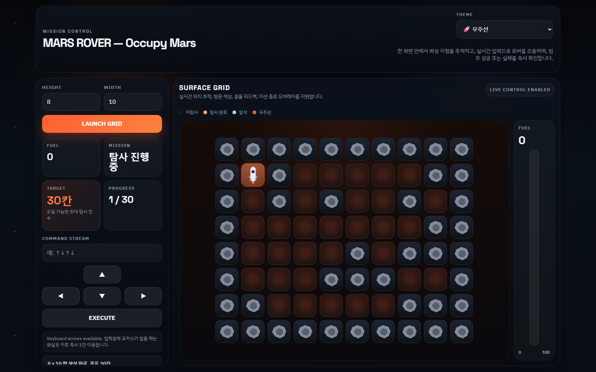

# Mars Rover KATA

Mars Rover KATA를 기반으로 만든 간단한 탐사 게임 프로젝트입니다.

## 게임 화면



## 구성

- Backend: `main.py` 단일 파일, Python + FastAPI
- Frontend: `index.html` 단일 파일, HTML + CSS + JavaScript
- Standalone 배포본: `mars-rover-game.html`

## 주요 기능

- 2차원 Grid 맵 생성
- 테두리 장애물 및 내부 랜덤 장애물 배치
- 우주선 시작 위치 `(1, 1)` 고정
- 방향 명령 기반 이동
- 연료, 방문 칸, 목표 수집 상태 표시
- 프론트 실시간 상태 갱신
- 우주선, 공룡, 아기상어, 악어, 토끼 테마 선택

## 실행 방법

개발 서버 실행:

```bash
python -m uvicorn main:app --reload
```

브라우저에서 `http://127.0.0.1:8000` 으로 접속합니다.

## 단일 파일 실행

`mars-rover-game.html` 파일은 백엔드 없이 브라우저에서 바로 열 수 있는 독립 실행 버전입니다.

## 파일 구조

- `main.py`: FastAPI 서버 및 게임 상태 로직
- `index.html`: 서버 연동 프론트엔드
- `mars-rover-game.html`: 단일 파일 배포용 프론트엔드
- `PLAN.md`: 현재 개발 계획
- `AGENTS.md`: 작업 규칙
